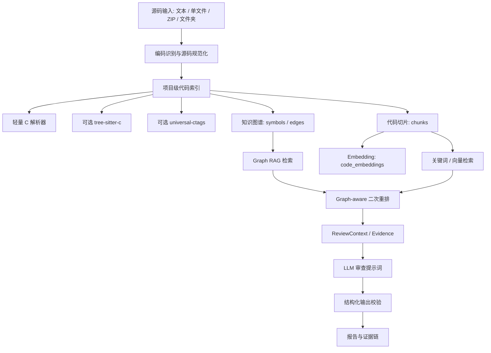

# RAG 系统架构和评测

## 1. 当前目标

C-Check 的 RAG 系统用于解决多文件 C 项目审查中的上下文缺失问题。传统按文件或按 chunk 直接送入模型时，模型容易看不到被调用函数定义、头文件声明、宏定义、类型定义和全局变量，导致误报、漏报或定位不准。

当前 RAG 目标是：

- 在项目级建立轻量代码知识图谱。
- 按函数、宏、声明、类型、全局变量、调用点等粒度切片。
- 审查前自动检索跨文件相关证据。
- 将证据以 Evidence 编号形式注入模型提示词。
- 对模型返回的 evidence、call_chain、代码片段做二次校验。
- 为后续 clangd/libclang、Qdrant、PostgreSQL 高级检索和多 GPU 审查单元调度打基础。

## 2. 总体架构

## 3. 技术栈

| 层级 | 当前实现 | 说明 |
| --- | --- | --- |
| 后端框架 | FastAPI + SQLAlchemy | API、任务、数据库访问 |
| 数据库 | 当前兼容 SQLite / 生产可用 PostgreSQL | 本地测试用 SQLite，迁移中已包含 PostgreSQL 检索索引 |
| 代码解析 | 内置轻量 C 解析器 | 当前主力解析器，已支持多行函数头、指针返回、宏修饰函数 |
| 可选解析增强 | tree-sitter-c | 小文件可用；复杂真实驱动文件可能回退到内置解析器 |
| 可选符号增强 | universal-ctags | 已有适配和 probe，环境安装后可补充符号 |
| 向量层 | hashing embedding + Qdrant 适配器 | 当前使用本地 deterministic embedding；Qdrant 在配置后可 upsert/search |
| 检索层 | Graph RAG + 关键词 + 向量 | 图谱关系优先，关键词/向量兜底 |
| 评估层 | evaluator.py | Recall@K、Precision@K、MRR、Token Waste Ratio |
| 测试 | PyTest + 服务器 mock 数据 | 覆盖 RAG 单测、真实 RT-Thread drivers 子集测试 |

## 4. 主要模块

| 模块 | 作用 |
| --- | --- |
| `parser.py` | 解析 include、macro、type、declaration、global variable、function、call |
| `tree_sitter_c.py` | 可选 tree-sitter-c 解析，带大小、行数、节点预算保护 |
| `ctags.py` | universal-ctags 符号补充和部署探测 |
| `chunker.py` | 构建 file_summary、function、function_window、macro、declaration、callsite 等 chunk |
| `graph_builder.py` | 构建 FILE_CONTAINS_SYMBOL、FUNCTION_CALLS_FUNCTION、SYMBOL_DEFINED_IN 等图谱边 |
| `embeddings.py` | 生成 deterministic hashing embedding，维护 code_embeddings |
| `qdrant.py` | Qdrant upsert/search 适配 |
| `keyword_search.py` | 标识符 exact / content fallback 检索 |
| `retriever.py` | Graph RAG、关键词、向量混合检索和二次重排 |
| `context_builder.py` | 将检索结果保存为 ReviewContext / ReviewEvidence |
| `evaluator.py` | 检索指标评估 |
| `planner.py` | 生成 file/function/callsite 审查单元 |

## 5. 切片策略

当前系统不是简单按固定字符数切片，而是优先按 C 代码结构切片：

| chunk 类型 | 切片依据 | 典型用途 |
| --- | --- | --- |
| `file_summary` | 文件级摘要 | 快速了解 include、函数、声明、宏 |
| `function` | 函数定义起止行 | 审查核心逻辑 |
| `function_window` | 超大函数滑窗 | 防止大函数超出 token 预算 |
| `declaration` | 函数声明 | 关联 `.h` 与 `.c` |
| `macro` | `#define` | 宏常量、宏函数、条件逻辑 |
| `struct/type/typedef/enum` | 类型定义 | 结构体字段、typedef 关系 |
| `global_variable` | 全局变量定义 | 资源、状态、共享变量 |
| `callsite` | 调用点上下文 | 定位调用发生位置 |

每个 chunk 都保存：

- 文件路径
- 起止行号
- 符号名
- 符号类型
- 内容 hash
- token 估算
- metadata

函数 chunk 额外保存：

- `called_symbols`
- `used_macros`
- `used_types`
- `used_globals`
- `source_tool`

## 6. 图谱设计

当前主要节点来自 `code_symbols` 和 `code_chunks`。

主要符号类型：

- `function`
- `declaration`
- `macro`
- `struct`
- `typedef`
- `type`
- `enum`
- `global_variable`

主要边类型：

| 边类型 | 含义 |
| --- | --- |
| `FILE_CONTAINS_SYMBOL` | 文件包含符号 |
| `FILE_INCLUDES_FILE` | 文件 include 另一个头文件 |
| `FUNCTION_CALLS_FUNCTION` | 函数调用函数 |
| `CALLSITE_CALLS_SYMBOL` | 调用点指向符号 |
| `SYMBOL_DECLARED_IN` | 声明关联定义 |
| `SYMBOL_DEFINED_IN` | 符号定义所在文件 |
| `FUNCTION_USES_MACRO` | 函数使用宏 |
| `FUNCTION_USES_TYPE` | 函数使用类型 |
| `FUNCTION_USES_GLOBAL` | 函数使用全局变量 |
| `FINDING_EVIDENCED_BY` | 模型 finding 关联证据 |

## 7. 检索与重排

### 7.1 检索来源

当前检索由六类候选组成：

1. include 头文件上下文
2. 直接调用函数上下文
3. 上游调用者上下文
4. 宏、类型、全局变量使用上下文
5. 关键词检索上下文
6. 向量相似检索上下文

### 7.2 Graph-aware 二次重排

当前已加入统一二次重排器，排序依据包括：

- 调用距离：直接调用优先于二跳调用。
- 关系类型：调用关系优先于 include、usage、关键词、向量。
- 符号类型：函数定义优先于声明、宏、全局变量。
- 文件相关性：同目录、同模块、同 stem 的文件更靠前。
- 风险 API 相关性：`memcpy/free/open/lock` 等相关证据加权。
- 噪声惩罚：`err/_fail/parent/start/config/callback` 等泛化符号降权。

### 7.3 同名符号处理

当前同名函数匹配策略：

1. 同文件函数定义优先。
2. 相关文件函数定义优先于当前文件声明。
3. 同目录、同模块、同 stem 的文件优先。
4. 再按符号置信度排序。

这能缓解同名函数、头文件声明、不同目录实现混淆的问题。

## 8. Prompt 与输出校验

RAG 检索结果会保存为 ReviewContext / ReviewEvidence，并注入模型提示词。每条证据包含：

- Evidence 编号
- 文件路径
- 符号名
- 行号范围
- 检索原因
- 证据内容

模型输出后会做二次校验：

- 清理不存在的 `evidence_ids`
- 校验 `call_chain` 是否能在图谱中成立
- 对缺失代码片段的 finding 自动从源文件补上下文
- 过滤无法定位到有效执行语句的数据行或无效行
- 将 finding 与 evidence 建立 `FINDING_EVIDENCED_BY` 边

## 9. 当前评测环境

评测在云服务器 `/opt/c-check` 上执行。

样本：

- RT-Thread `components/drivers` 抽样 80 个 `.c/.h` 文件
- 源码体量：`883,206 bytes`
- 覆盖目录：ata、audio、block、can、clk、core、dma、firmware、graphic、i2c、input、ipc 等多类驱动

当前分支：

- `C-Check-GpuPlus-RAG`

评测提交：

- `26080f1 Add graph-aware RAG reranking`

## 10. 最终指标

### 10.1 切片规模

| 指标 | 数值 |
| --- | ---: |
| 文件数 | 80 |
| 源码大小 | 883,206 bytes |
| `file_summary` | 80 |
| `macro` | 1,076 |
| `struct` | 918 |
| `declaration` | 175 |
| `global_variable` | 1,255 |
| `function` | 947 |
| `callsite` | 4,580 |
| `function_window` | 152 |
| `type` | 19 |
| `typedef` | 1 |

### 10.2 索引规模

| 指标 | 数值 |
| --- | ---: |
| 符号总数 | 4,391 |
| 图谱边总数 | 29,117 |
| chunk 总数 | 9,203 |
| embedding 数 | 9,203 |

### 10.3 图谱边统计

| 边类型 | 数量 |
| --- | ---: |
| `FILE_INCLUDES_FILE` | 291 |
| `FILE_CONTAINS_SYMBOL` | 4,391 |
| `SYMBOL_DECLARED_IN` | 175 |
| `SYMBOL_DEFINED_IN` | 947 |
| `FUNCTION_CALLS_FUNCTION` | 4,580 |
| `CALLSITE_CALLS_SYMBOL` | 4,580 |
| `FUNCTION_USES_TYPE` | 2,361 |
| `FUNCTION_USES_GLOBAL` | 13,654 |
| `FUNCTION_USES_MACRO` | 885 |

### 10.4 切片准确性和依从性

| 指标 | 数值 |
| --- | ---: |
| chunk 锚点依从性 | 100% |
| chunk 元数据依从性 | 100% |
| symbol -> chunk 覆盖率 | 100% |
| edge target 有效性 | 100% |
| embedding per chunk | 100% |
| Evidence schema 依从性 | 100% |

### 10.5 符号覆盖率

| 指标 | 数值 |
| --- | ---: |
| 宏定义覆盖率 | 100.00% |
| include 覆盖率 | 100.00% |
| 函数定义覆盖率 | 106.40% |
| 函数声明覆盖率 | 92.11% |

说明：函数定义覆盖率超过 100%，是因为旧基准正则漏掉了指针返回、多行参数、宏修饰函数；当前解析器识别到了更多真实函数。这里的 106.40% 不是重复率，而是相对保守基准的增强覆盖。

### 10.6 检索指标

| 指标 | 数值 |
| --- | ---: |
| 调用目标 Recall@20 | 100.00% |
| 跨文件调用 Recall@20 | 94.58% |
| 跨文件调用边 | 428 |
| 同文件调用边排除 | 1,260 |
| 参与跨文件评估文件数 | 53 |
| 跨文件完整命中文件 | 47 |
| 跨文件零命中文件 | 0 |
| Mean Precision for expected target | 0.14 |
| Mean MRR | 0.33 |
| Mean Token Waste Ratio | 0.86 |

召回率已经较高，Precision 和 Token Waste Ratio 仍有优化空间。这说明“关键证据基本能找回来”，但 topK 中仍包含一定比例陪跑证据。

## 11. 已解决的问题

### 11.1 真实驱动源码解析卡顿

问题：

- RT-Thread 真实驱动文件触发内置正则回溯和 tree-sitter native parse 卡顿。

解决：

- 将函数、声明、全局变量正则改为更保守的线性匹配。
- 对长行设置匹配上限。
- tree-sitter 增加源码大小、行数、节点数、声明扫描预算。
- 复杂文件自动回退到内置解析器。

### 11.2 多行函数定义漏检

问题：

- 大量 C 项目函数采用 `{` 换行或参数跨多行风格，旧解析器漏检。

解决：

- 支持多行函数头。
- 支持指针返回值。
- 支持宏修饰返回类型。
- 支持单行函数体中的调用识别。

### 11.3 检索排序被关键词噪声占满

问题：

- `err`、`_fail`、`parent` 等局部变量曾被关键词 exact 高分命中，挤掉真实跨文件函数定义。

解决：

- 图谱关系优先。
- 关键词降权。
- 噪声符号降权。
- 同名函数按文件相关性重排。

## 12. 当前泛化能力评估

当前函数识别方案对以下 C 风格具有较好泛化能力：

- K&R 之后的常规 ANSI C 函数定义
- `{` 单独换行风格
- 参数跨多行风格
- 指针返回值风格，如 `char *foo(...)`
- `static inline` 风格
- RT-Thread 这类宏修饰返回类型，如 `RT_WEAK rt_err_t foo(...)`
- 单行函数体，如 `int foo(void) { return 0; }`

仍然不完全覆盖的场景：

- 旧式 K&R 函数定义
- 极复杂函数指针返回类型
- 宏生成函数定义
- 条件编译后才出现的函数
- 依赖编译参数才能确认的 typedef / macro
- 函数指针表和 ops 表的动态分发

这些需要 clangd/libclang 或预处理视图进一步增强。

## 13. 可深度优化点

### 13.1 引入 clangd/libclang

优先级最高。可解决：

- 同名函数精确绑定
- static 作用域
- 声明/定义跳转
- typedef 解析
- 条件编译
- 宏展开
- 函数指针调用

### 13.2 建立人工金标集

当前评测基准主要来自正则和图谱自举。下一步应建立人工标注数据集：

- 真实 C 项目片段
- 人工标注函数、声明、宏、类型、调用边
- 人工标注审查目标应召回 evidence
- 记录 Recall@K、Precision@K、MRR、Token Waste Ratio

### 13.3 证据预算分配

当前 Recall 高，但 Token Waste Ratio 仍偏高。可按预算分桶：

- 40% 直接调用函数
- 20% 声明和头文件
- 15% 宏、类型、全局变量
- 15% 风险 API 相关上下文
- 10% 向量兜底

### 13.4 函数指针和 ops 表建模

驱动项目常见：

- `struct ops`
- `probe/remove`
- `ioctl/control`
- callback
- function pointer dispatch

建议新增边：

- `STRUCT_FIELD_POINTS_TO_FUNCTION`
- `FUNCTION_ASSIGNED_TO_CALLBACK`
- `CALLS_THROUGH_FUNCTION_POINTER`
- `DRIVER_OPS_DISPATCHES_TO`

### 13.5 预处理视图

建议引入：

- `clang -E`
- `compile_commands.json`
- 项目配置头文件

形成“原始源码视图 + 预处理视图”双轨索引，解决宏生成代码和条件编译问题。

### 13.6 Qdrant 正式向量检索

当前已有 Qdrant 适配，但评测主要使用本地 hashing embedding。后续可接入真实 embedding：

- 代码专用 embedding 模型
- Qdrant payload filter
- historical finding 相似检索
- 修复建议相似样例检索

### 13.7 PostgreSQL 高级检索

已提供迁移基础，后续可进一步强化：

- full-text search
- trigram / GIN
- symbol exact index
- BM25 风格排序

### 13.8 增量索引缓存

对重复上传和项目更新：

- 文件 hash 不变复用文件索引
- 函数 hash 不变复用函数 chunk
- chunk hash 不变复用 embedding
- Qdrant point 按 hash 去重

### 13.9 多 GPU 审查单元调度

将当前文件级任务升级为：

- 函数审查单元
- 调用子图审查单元
- 风险 API 审查单元

这样可以提升 GPU 利用率，也能降低单次上下文长度。

## 14. 结论

当前 RAG 系统已经从“简单追加上下文”升级为“项目级图谱 + 结构化切片 + 混合检索 + 二次重排 + 证据链校验”的可用版本。

当前最强项：

- 宏、include、函数定义、调用点、chunk 元数据覆盖较完整。
- 跨文件调用 Recall@20 达到 94.58%。
- 调用目标抽样 Recall@20 达到 100%。
- 证据链依从性达到 100%。

当前主要短板：

- Precision 和 Token Waste Ratio 仍需优化。
- 缺少 clangd/libclang 语义级解析。
- 缺少人工金标评估集。
- 函数指针、ops 表、宏展开、条件编译仍需专门增强。

建议下一阶段优先做：

1. clangd/libclang 语义索引。
2. 人工金标评估集。
3. evidence 预算分配和去重压缩。
4. 函数指针 / ops 表图谱建模。
5. Qdrant 真实 embedding 检索闭环。
