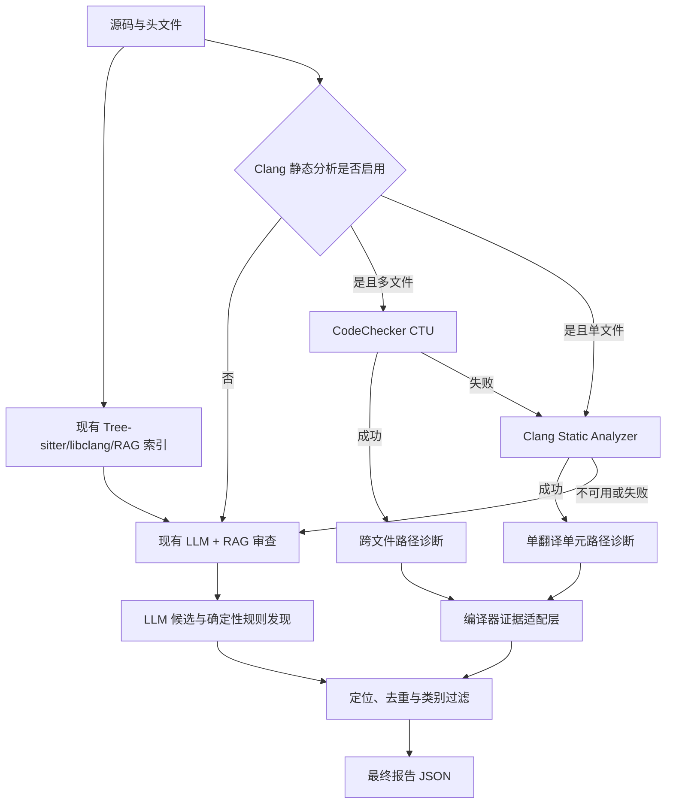

# C 语言资源生命周期分析：Clang Static Analyzer 与 CodeChecker CTU 接入记录

## 1. 问题背景

项目此前使用 LLM 候选发现、RAG 上下文补偿和后端轻量规则共同生成代码审查报告。该流程对缓冲区越界、整数安全和明显内存错误已有较好效果，但在 `resource_leak` 类别中出现过以下误报：

- `FILE *log_fp = fopen(...)` 在主流程末尾存在 `fclose(log_fp)`，仍被报告为文件句柄泄漏。
- `PageManager *mgr = page_mgr_create(...)` 在程序末尾存在 `page_mgr_destroy(mgr)`，仍被报告为堆资源泄漏。
- 循环中的 `load_log_page(...)` 只读取数据且不取得资源所有权，却被报告为资源泄漏。
- 栈数组和普通局部变量被错误理解为需要显式释放的堆资源。

这些问题并非简单的提示词问题。资源泄漏判断要求回答以下问题：

1. 哪条语句真正取得了资源所有权？
2. 所有可达控制流路径是否都执行了匹配的释放操作？
3. 是否存在提前 `return`、`goto cleanup`、错误分支或循环退出绕过释放？
4. 资源是否通过结构体成员、别名、函数返回值或跨文件调用发生转移？

正则表达式只能判断函数文本中是否出现某种调用，无法证明每条路径上的资源状态。因此继续扩充获取/释放函数名称会增加维护成本，也可能出现“函数中某处存在 `fclose`，但泄漏分支仍被误删”的假阴性。

## 2. 旧实现及局限

旧流程如下：

```text
LLM 第一阶段候选
  -> 后端定位与去重
  -> 正则识别 malloc/fopen/*_create
  -> 在函数文本中查找 free/fclose/destroy
  -> 保留或过滤候选
  -> 第二阶段类型整理
  -> 最终报告
```

轻量规则在修复确定性误报时有效，且执行成本很低，但存在以下结构性限制：

- 函数边界依赖文本扫描，容易受跨行声明、宏和复杂语法影响。
- 不具备控制流图，无法区分不同分支的释放状态。
- 不具备符号状态与别名分析，难以处理结构体成员和所有权转移。
- 跨文件自定义 `create/destroy` 只能根据命名猜测语义。
- “看到释放调用”不等于“所有路径都释放”。

因此，旧规则保留为外部工具不可用时的快速降级方案，不再作为复杂资源生命周期问题的长期分析核心。

## 3. 修改思路

本次采用“编译器分析负责证明、RAG 负责关系补偿、LLM 负责候选发现与解释”的分层方案：

1. 使用 Clang Static Analyzer 构建 AST、控制流和符号状态。
2. 单文件场景直接运行 Clang 路径敏感分析。
3. 多文件场景优先由 CodeChecker 执行 Cross Translation Unit（CTU）分析。
4. CTU 将外部函数定义按需引入调用者分析，识别自定义工厂函数内部的真实分配行为。
5. 将 Clang plist 报告转换为项目统一的 `ReviewFinding`。
6. 编译器已给出可行路径的诊断作为权威补充，不再经过旧的路径不敏感资源过滤器。
7. CodeChecker 失败时退回单文件 Clang；Clang 不可用时继续使用现有 LLM+RAG+规则链路。

整个功能由 `CLANG_STATIC_ANALYSIS_ENABLED` 控制，当前默认值为 `false`。因此代码接入不会在未经验收的情况下改变已有生产结果。

## 4. 最新架构



### 4.1 主要实现文件

- `backend/app/services/code_index/clang_static_analyzer.py`
  - 安全地将任务源码写入临时目录。
  - 探测 Clang 可用 checker，兼容不同 LLVM 版本。
  - 单文件执行 Clang Static Analyzer。
  - 多文件生成临时 `compile_commands.json` 并执行 CodeChecker CTU。
  - 解析 plist 中的 checker、位置和路径步骤。
  - 将诊断映射为项目的风险类别和严重等级。
- `backend/app/services/model_router.py`
  - 在候选整理阶段可选运行 Clang 分析。
  - 将分析状态、耗时、诊断数量和错误写入模型日志。
  - 编译器路径诊断独立合并，避免被旧资源过滤器错误删除。
- `backend/app/core/config.py`
  - 增加功能开关、可执行文件、超时、最大文件数和 CTU 开关。
- `backend/tests/fixtures/static_analysis/resource_lifecycle/`
  - 跨文件资源生命周期金标项目。
- `backend/tests/test_clang_static_analyzer.py`
  - 降级、plist 解析、清洁分析和真实 CTU 验收测试。

### 4.2 降级与可靠性设计

```text
CodeChecker CTU
  -> 失败：单文件 Clang
      -> 失败或工具不存在：现有 LLM+RAG+静态规则
```

外部分析器异常不会中断审查任务。工具不可用、执行超时、编译失败或 plist 损坏均记录到日志，并继续原有稳定流程。

## 5. 前后对比

| 能力 | 旧实现 | 最新 POC |
|---|---|---|
| 函数边界 | 文本与花括号扫描 | Clang AST/CFG |
| 分支处理 | 函数内是否出现释放 | 每条可达路径的符号状态 |
| 提前返回 | 容易被函数末尾释放掩盖 | 可定位绕过释放的具体路径 |
| `goto cleanup` | 依赖文本规则 | 按真实控制流分析 |
| 结构体成员资源 | 支持有限 | Clang 内存区域跟踪 |
| 跨文件自定义资源 | 根据命名猜测 | CTU 进入函数定义并识别内部 `malloc/free` |
| 普通函数调用 | 可能误判为所有权获取 | 无获取语义时不会产生资源诊断 |
| 路径证据 | 无 | plist 包含逐步执行路径 |
| 工具失败 | 无外部工具 | CTU、Clang、原流程三级降级 |
| 默认影响 | 规则直接参与 | 新功能默认关闭 |

## 6. 测试设计

跨文件金标项目包含两个源文件和一个头文件，覆盖以下场景：

### 6.1 真实漏洞

1. `leak_on_early_return`
   - `fopen` 后在某分支提前返回。
   - 其他路径存在 `fclose`，用于验证路径敏感能力。
2. `leak_struct_member`
   - 文件句柄保存在结构体成员中且未关闭。
3. `leak_custom_resource`
   - 调用跨文件 `page_mgr_create`。
   - 真实分配发生在另一个 `.c` 文件中。
   - 调用者未执行 `page_mgr_destroy`。

### 6.2 安全场景

1. `clean_unified_cleanup`
   - 使用 `goto cleanup` 统一执行 `free/fclose`。
2. `clean_struct_member`
   - 结构体中的堆内存与文件句柄均完成释放。
3. `clean_custom_resource`
   - 跨文件创建对象后调用匹配的销毁函数。

此外，使用此前困难 C 源码复测 `fopen`、`page_mgr_create`、循环内 `load_log_page` 和函数末尾统一释放场景。

## 7. 测试结果

### 7.1 金标指标

| 方案 | 命中数 | 误报数 | 召回率 | 精确率 | 分析耗时 |
|---|---:|---:|---:|---:|---:|
| 单文件 Clang | 2/3 | 0 | 66.7% | 100% | 0.1263 秒 |
| CodeChecker CTU | 3/3 | 0 | 100% | 100% | 1.1893 秒 |

单文件 Clang 未命中跨文件自定义资源，因为调用者翻译单元中只有函数声明。启用 CTU 后，分析器进入 `page_mgr_create`，发现其内部的 `malloc`，并生成 22 步跨文件执行路径，召回率由 66.7% 提升至 100%。

两个标准流资源漏洞分别产生 9 步路径证据。三个安全函数均未产生报告，因此该测试集上的精确率为 100%。

### 7.2 困难源码复测

- 分析耗时：1.2614 秒。
- 资源泄漏诊断：0。
- 原 `fopen`、`page_mgr_create` 和 `load_log_page` 三条误报未再次出现。
- Clang 额外发现 1 条未初始化实参问题，路径包含 70 个步骤。

### 7.3 自动化回归

- 本地完整后端测试：`216 passed, 1 skipped, 3 warnings`。
  - 跳过项为真实 Clang CTU 测试，本地 Windows 环境没有 Clang/CodeChecker。
- 云服务器真实 CTU 测试：`4 passed`。
- 云服务器完整后端测试：业务相关测试 `216 passed`。
  - 另有 1 项配置默认值测试受服务器现有 `.env` 中 `MOCK_MODEL_ENABLED=true` 影响，与本次实现无关。

## 8. 是否解决原问题

本次 POC 已经从架构上解决原问题中的主要部分：

- 函数末尾统一 `fclose` 和 `destroy` 不再误报。
- 某个提前返回分支遗漏释放时仍可被识别，不会被其他安全路径掩盖。
- 结构体成员资源可以正确跟踪。
- 普通读取函数不会因名称或局部变量被当成资源获取。
- 跨文件自定义创建函数可通过 CTU 识别内部真实分配。
- 分析结论携带执行路径，可用于后续前端证据展示和 LLM 解释。

## 9. 当前限制与后续工作

### 9.1 编译参数

POC 当前为上传的 C 文件生成通用 `compile_commands.json`。真实项目中的以下信息尚未完整透传：

- 交叉编译器参数。
- 平台宏和条件编译宏。
- 非标准 include path。
- 编译器扩展和目标架构参数。

正式启用前应允许压缩包携带并安全解析原项目 `compile_commands.json`，同时对路径和可执行参数进行白名单处理。

### 9.2 无源码的外部资源 API

如果资源创建函数来自闭源库或预编译 SDK，CTU 无法进入函数体。后续需要项目级资源协议表，描述：

- acquire：取得所有权。
- release：释放所有权。
- transfer：转移所有权。
- borrow：仅借用、不负责释放。

协议应由标准库内置规则、静态推断和 LLM 候选共同生成，并经管理员确认后持久化。

### 9.3 证据持久化

当前路径步骤保存在适配器结果中，但尚未写入 `review_evidence` 并展示在报告页面。后续应保存 checker、路径节点、跨文件调用和资源状态变化，供管理员审计。

### 9.4 性能与启用策略

小型金标项目的 CTU 开销约 1.2 秒，但大型项目需要继续测量：

- 源文件数量与 CTU 耗时关系。
- AST/PCH 缓存复用率。
- 单任务超时和并发隔离。
- 编译失败率与降级比例。
- 静态证据对最终误报率和召回率的真实改善。

建议在完成真实项目基准测试前保持功能默认关闭，并先以“编译器确认的补充发现”方式灰度启用，不直接使用“无诊断”作为绝对安全证明。

## 10. 结论

测试证明，Clang Static Analyzer 与 CodeChecker CTU 能以较低的时间成本解决正则无法可靠处理的资源配对、分支路径、结构体成员和跨文件自定义资源问题。该方案没有替代现有 LLM+RAG，而是为其增加确定性的编译器证据层：

```text
Clang/CTU 负责路径证明
RAG 负责代码关系和上下文补偿
LLM 负责广泛候选发现、语义解释和报告生成
```

POC 已通过正反金标、困难源码和完整回归测试，具备继续工程化的价值。正式默认启用前仍需完成真实编译数据库透传、外部资源协议、证据持久化和大项目性能验收。
