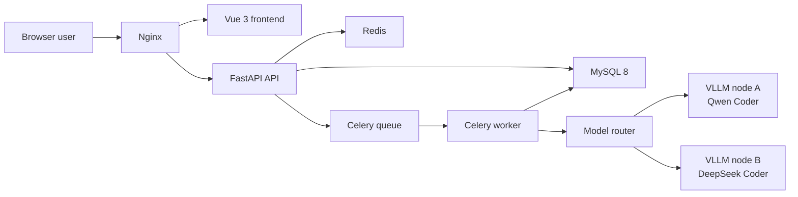

# C Language AI Code Review Platform Design

## 1. Goal

Build a production-oriented C language AI code review platform for individual
developers and embedded or systems teams. The platform provides browser-based
submission, asynchronous review, structured reports, account isolation,
administration, and Docker Compose deployment. AI inference is handled by
independently deployed VLLM nodes.

The first release must remain usable for local development without a GPU. A
mock model is available only when `MOCK_MODEL_ENABLED=true` is explicitly set.
Production configuration disables mock inference by default. If a configured
VLLM node is unavailable, the review fails and no report is generated.

## 2. Scope

### Included

- Vue 3, Vite, Element Plus, Pinia, Vue Router, and ECharts frontend.
- FastAPI backend with JWT authentication and role-based access control.
- MySQL 8 persistence and Alembic database migrations.
- Redis and Celery asynchronous review execution.
- Nginx reverse proxy and static frontend hosting.
- Docker Compose application deployment.
- Independent Linux VLLM node configuration and startup examples.
- Text paste, single `.c` or `.h` upload, and ZIP project upload.
- Single-model selection for each review task.
- Structured C language review reports with Markdown and PDF export.
- Personal report history and administrative management pages.
- Explicit development-only mock model mode.
- Backend automated tests and frontend build verification.

### Excluded From The First Release

- Multi-model comparison within a single review task.
- Public registration and invitation registration.
- Kubernetes deployment.
- Automatic fallback to mock inference when a real model fails.
- Automatic remote installation of GPU drivers or model weights.

## 3. Architecture

The application uses a modular monolith for business features and independent
VLLM nodes for inference. This provides a straightforward Docker Compose
deployment while keeping the model layer horizontally extensible.



Application services start with:

```bash
docker compose up -d --build
```

VLLM nodes run separately on Linux GPU servers and expose OpenAI-compatible
`/v1/chat/completions` endpoints. Administrators configure each node's display
name, model identifier, base URL, API key, timeout, enabled state, and
description.

## 4. Frontend Design

The frontend uses a restrained iOS-inspired enterprise style: low-saturation
blue and slate colors, translucent surfaces, generous spacing, consistent
rounded corners, readable code blocks, and limited motion.

### Pages

1. **Login**
   - Username and password authentication.
   - No public registration entry point.
   - Clear expired-session and invalid-credential feedback.

2. **Review Workspace**
   - Input tabs for pasted text, one `.c` or `.h` file, or one `.zip` archive.
   - Online model selector with capability descriptions and health state.
   - Submission validation feedback.
   - Recent task status cards with queued, running, completed, and failed
     states.

3. **Report Detail**
   - Summary, score, severity totals, category distribution, and review
     metadata.
   - Findings ordered by severity with category, file, line, code snippet,
     explanation, and remediation.
   - Markdown and PDF download actions.

4. **History**
   - Current user's tasks only.
   - Filters for keyword, state, model, severity, and creation time.
   - Open, download, and delete actions.

5. **Admin**
   - Overview metrics.
   - User creation, disabling, and password reset.
   - Model node creation, update, enable or disable, and health check.
   - Prompt version viewing and update.
   - Platform-wide task list.

6. **Profile**
   - Current account information.
   - Password update.

### State And API Access

Pinia stores the active session and basic user identity. Axios provides a
single API client with bearer-token injection and unauthorized-session
handling. Vue Router guards authenticated pages and administrator-only pages.

## 5. Backend Design

### Modules

- `auth`: login, current user, password update, JWT handling, and admin user
  management.
- `reviews`: submission validation, source storage, ZIP extraction, task
  creation, status query, history filtering, and deletion.
- `model_router`: configured model lookup, health checks, mock-model opt-in,
  VLLM requests, and structured-response validation.
- `prompts`: active prompt retrieval, versioning, and C-specific review
  instructions.
- `reports`: report persistence, summary calculation, Markdown rendering, and
  PDF rendering.
- `admin`: dashboard metrics and platform-wide management endpoints.
- `worker`: Celery task that performs model invocation and persists terminal
  task state.

### Primary Data Model

- `users`: username, password hash, role, enabled state, creation time, and
  update time.
- `model_nodes`: display name, model identifier, base URL, encrypted or
  protected API key value, timeout, enabled state, description, and timestamps.
- `prompt_versions`: version, prompt body, active state, creator, and
  timestamps.
- `review_tasks`: owner, selected model, input mode, display name, state,
  progress, error message, duration, file count, finding count, and
  timestamps.
- `review_files`: task, relative path, source text, size, and timestamps.
- `reports`: task, summary, score, severity counters, category counters,
  structured result JSON, and timestamps.

Task states are `queued`, `running`, `completed`, and `failed`.

### Submission Rules

- Pasted code is stored as `snippet.c`.
- Single-file uploads allow `.c` and `.h` only.
- ZIP uploads accept `.zip` only and extract `.c` and `.h` files only.
- ZIP extraction rejects absolute paths, parent traversal, symbolic links,
  oversized files, archives exceeding the configured extracted-size limit,
  and archives exceeding the configured source-file count.
- Empty submissions and ZIP archives with no valid source files are rejected.
- Upload limits are environment-configurable.

### Authentication And Authorization

- Passwords are hashed with a modern password-hashing implementation.
- The login endpoint issues signed JWT bearer tokens with configurable expiry.
- Initial startup creates an administrator from environment variables when no
  administrator exists.
- Ordinary users can access only their own tasks and reports.
- Administrator endpoints require the `admin` role.
- Public registration is not exposed.

## 6. Review Data Flow

1. The user authenticates and chooses one enabled model node.
2. The user submits pasted code, one source file, or one ZIP archive.
3. The API validates and stores the submission, creates a `queued` task, and
   enqueues a Celery job.
4. The worker changes the task to `running`, loads the active C review prompt,
   and calls the selected VLLM node.
5. The model returns JSON with a summary, score, and findings.
6. The worker validates the JSON schema, calculates counters, stores the
   report, and changes the task to `completed`.
7. The frontend polls task state and displays the report when available.

Each finding contains:

- severity: `high`, `medium`, `low`, or `suggestion`
- category
- title
- file path
- start line and optional end line
- code snippet
- explanation
- remediation

## 7. Failure Handling

- VLLM offline, timeout, authentication failure, invalid JSON, or schema
  mismatch: mark task as `failed`, record a clear error message, and do not
  create a report.
- Invalid file extension, empty input, unsafe ZIP path, excessive upload size,
  excessive extracted size, or excessive file count: reject submission before
  enqueueing.
- Disabled account: reject authentication and protected API access.
- Ordinary user requesting another user's resource or an admin endpoint:
  return `403`.
- Missing report for a completed-only download endpoint: return `404`.
- Mock inference: available only with `MOCK_MODEL_ENABLED=true`; it is never
  used as an automatic fallback.

## 8. Deployment Design

Docker Compose is the primary deployment path and starts:

- `nginx`
- `frontend`
- `api`
- `worker`
- `redis`
- `mysql`

The repository includes:

- `.env.example` with required application and integration settings.
- `docker-compose.yml`.
- Dockerfiles for frontend and backend services.
- Nginx configuration.
- `start.sh` wrapper with `install`, `start`, `stop`, `status`, and `logs`
  commands.
- An independent VLLM node example script and configuration notes.
- Linux deployment documentation covering environment setup, model node
  registration, migrations, first login, health checks, and operations.

The application Compose stack does not install GPU drivers, download large
model weights, or SSH into remote model hosts. Those concerns stay explicit in
the VLLM node documentation because GPU topology, authentication, storage, and
driver versions differ between servers.

## 9. Testing And Acceptance

### Automated Backend Tests

- Login success, invalid credentials, disabled account, and role isolation.
- Initial administrator creation.
- Text, source-file, and ZIP submissions.
- ZIP traversal rejection, size limits, and no-C-file rejection.
- Model router success, timeout, offline response, invalid JSON, and mock-mode
  opt-in behavior.
- Worker success and strict failure state transitions.
- History ownership isolation and filtering.
- Markdown and PDF report downloads.
- Administrator user, model, and prompt management.

### Frontend Verification

- Production build completes.
- Login route and authenticated route guards work.
- Workspace supports all three input modes.
- Task progress and failure state display correctly.
- Completed report renders charts and findings.
- History filters and admin-only navigation render correctly.

### Deployment Acceptance

- `docker compose up -d --build` starts the application services.
- First startup creates the configured administrator.
- An administrator can create users, add model nodes, and update prompts.
- A normal user can submit all three input modes, observe task state, open
  historical reports, and download Markdown or PDF.
- When a VLLM node is unavailable, the task reaches `failed` with a diagnostic
  message and no report.
- Linux deployment documentation explains model node access settings and
  routine operations.

## 10. Delivery Sequence

Implementation proceeds in independently verifiable slices:

1. Repository skeleton, configuration, database schema, and authentication.
2. Review submission validation, storage, and task state API.
3. Prompt management, model routing, Celery execution, and report persistence.
4. Report export and history endpoints.
5. Vue frontend pages and visual system.
6. Administrative frontend and backend.
7. Docker Compose, Nginx, VLLM examples, and Linux documentation.
8. Automated tests, frontend build, and local mock-mode browser verification.

