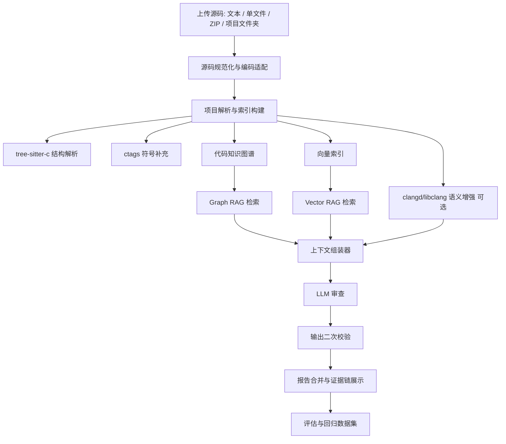
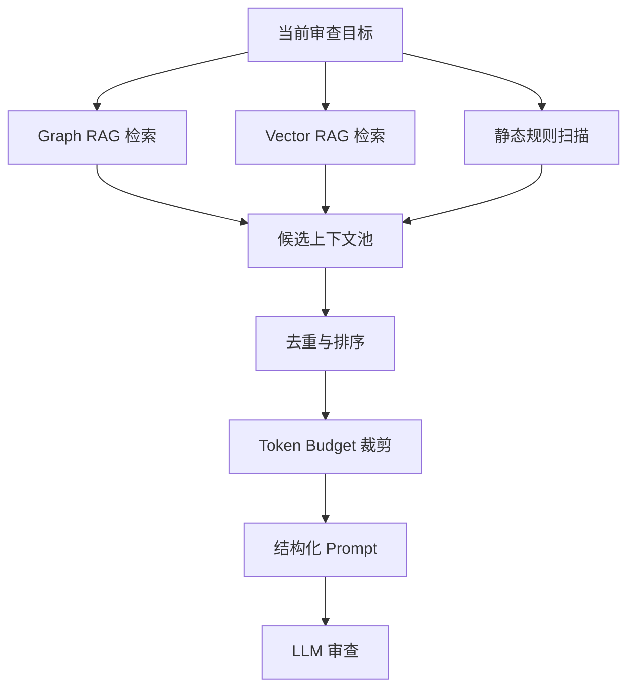

# 提升审查可靠性：代码知识图谱 RAG 架构设计

## 1. 背景与目标

当前 C-Check 已经具备代码上传、分片审查、多 GPU 批次调度、模型结构化输出和报告生成能力。但在多文件项目审查中，仍然存在一个核心可靠性问题：

- 模型审查某个文件或 chunk 时，可能看不到被调用函数的定义。
- `.h` 中声明、`.c` 中实现、宏定义、结构体、全局变量之间的关系没有被显式建模。
- 多 GPU 批量下发为了提高吞吐，会把多文件拆成独立批次，这进一步削弱了跨文件上下文。
- LLM 只能基于当前可见文本做判断，无法稳定完成“跳转定义”“调用链追踪”“数据流分析”。

因此，下一阶段应把 C-Check 从“文件级 LLM 审查”升级为“代码知识图谱增强的 RAG 审查系统”。

目标：

- 建立项目级代码知识图谱，显式记录文件、函数、宏、结构体、声明、调用点之间的关系。
- 审查某个文件、函数或 chunk 前，自动检索相关上下文，而不是盲目塞入整个项目。
- 结合 Graph RAG、Vector RAG、静态分析和 LLM，提升跨文件审查能力。
- 对检索、上下文、模型输出和最终报告建立可评估、可回归的质量体系。
- 保留现有多 GPU 调度优势，同时提高每个审查批次的上下文完整性。

## 2. 总体架构



系统分为六层：

1. **源码接入层**
   负责上传、解压、编码识别、路径安全、大小限制、文件过滤。

2. **解析索引层**
   负责提取函数、宏、结构体、include、调用关系、声明定义关系。

3. **知识存储层**
   存储图谱节点、边、源码 chunk、符号表、向量索引和审查历史。

4. **RAG 检索层**
   结合图谱关系检索、向量相似检索、规则检索和 token budget 控制。

5. **LLM 审查层**
   将当前审查对象和相关上下文组合后交给模型，输出结构化结果。

6. **质量评估层**
   对检索召回、上下文有效性、模型输出准确性、报告稳定性进行评估。

## 3. 技术栈建议

### 3.1 解析与静态分析

| 能力 | 推荐工具 | 作用 | 优先级 |
| --- | --- | --- | --- |
| C 语法结构解析 | tree-sitter-c | 提取函数、调用点、宏、结构体、行号范围 | P0 |
| 符号提取 | universal-ctags | 补充函数、变量、宏、typedef、enum | P0 |
| 语义跳转 | clangd / libclang | 准确解析声明/定义、类型、宏展开 | P1 |
| 规则扫描 | Semgrep | 快速发现已知危险模式 | P1 |
| 深度数据流 | CodeQL / Joern | 调用图、数据流、资源流、污点分析 | P2 |

推荐落地顺序：

1. **第一版直接落地 `tree-sitter-c + universal-ctags`。** 先把函数、调用、include、宏、结构体、符号表、基础图谱和混合检索跑通，形成轻量可用版本。
2. **第二版接入 `clangd/libclang`。** 重点解决声明/定义精确匹配、类型匹配、同名函数、`static` 作用域、宏展开和条件编译问题。
3. 后续再按安全专项引入 Semgrep、CodeQL 或 Joern，补充规则扫描和数据流能力。

### 3.2 存储方案

考虑该项目会面向多文件目录、历史报告、向量检索和后续多用户并发，数据库建议从一开始按中等规模设计，避免轻量原型后频繁迁移。

推荐优先级：

1. **PostgreSQL + Qdrant，确定采用的默认方案。**
   - PostgreSQL 负责业务数据、用户、任务、报告、源码文件、符号表、知识图谱节点和边。
   - PostgreSQL 的全文检索、trigram/GIN 索引和普通 B-tree 索引用于函数名、变量名、宏名、结构体名等关键字检索。
   - Qdrant 负责向量检索，存储函数 chunk、宏/结构体定义、历史 finding、修复样例等 embedding。
   - Qdrant 免费开源、部署轻量、API 简洁，适合作为 C-Check 第一版向量库，并为后续扩展留空间。
   - 该组合能把“结构化图谱/关键字检索”和“语义向量检索”分层治理，职责更清晰。

2. **Milvus，作为远期超大规模或集群化向量检索备选。**
   - 免费开源，吞吐和扩展能力强。
   - 部署和运维复杂度高于 Qdrant。
   - 更适合后续代码库数量很大、embedding 数量达到千万级以上的场景。

不建议第一版使用 Neo4j 作为主存储。知识图谱先用 PostgreSQL 表结构表达，向量检索直接使用 Qdrant。后续如果图查询深度和复杂度明显上升，再考虑 Neo4j、NebulaGraph 或 PostgreSQL + Apache AGE。

建议表：

- `code_projects`
- `code_files`
- `code_symbols`
- `code_edges`
- `code_chunks`
- `code_embeddings`
- `review_contexts`
- `review_evidence`

图谱节点类型：

- `file`
- `function`
- `declaration`
- `macro`
- `struct`
- `typedef`
- `enum`
- `global_variable`
- `callsite`
- `chunk`

图谱边类型：

- `FILE_CONTAINS_SYMBOL`
- `FILE_INCLUDES_FILE`
- `FUNCTION_CALLS_FUNCTION`
- `CALLSITE_CALLS_SYMBOL`
- `SYMBOL_DECLARED_IN`
- `SYMBOL_DEFINED_IN`
- `FUNCTION_USES_MACRO`
- `FUNCTION_USES_TYPE`
- `FUNCTION_USES_GLOBAL`
- `CHUNK_CONTAINS_SYMBOL`
- `FINDING_EVIDENCED_BY`

后续如果图查询复杂度上升，可以将 `code_edges` 同步到 Neo4j、NebulaGraph 或 PostgreSQL + Apache AGE，但主业务数据仍建议保留在 PostgreSQL。

### 3.3 向量检索

向量库选择：

- 默认：Qdrant。
- 业务主库、图谱节点边、符号表和关键字检索：PostgreSQL。
- 超大规模、集群化向量检索：Milvus 作为远期备选。

第一版建议直接采用 PostgreSQL + Qdrant。PostgreSQL 负责确定性结构数据和关键字检索，Qdrant 负责 embedding 向量检索。这样从一开始就把向量服务独立出来，便于后续扩容、迁移和横向扩展。

嵌入对象：

- 函数级代码块
- 宏/结构体定义块
- 头文件声明块
- 已确认问题的历史 finding
- 修复前后代码片段
- 项目内相似实现

向量检索主要解决“相似代码”和“历史问题复用”，图谱检索主要解决“结构关系”。两者应混合使用。

此外，代码检索必须加入关键字检索权重。函数名、变量名、宏名、结构体名通常是稳定且高精度的信号，不能只依赖 embedding。推荐同时建立：

- PostgreSQL full-text search，用于注释、标识符分词和历史 finding。
- trigram / GIN 索引，用于函数名、变量名、宏名的模糊匹配。
- 精确 symbol name 索引，用于 `handle_packet`、`MAX_LEN` 这类确定符号。

## 4. 代码知识图谱设计

### 4.1 节点设计

`code_symbols` 示例字段：

| 字段 | 说明 |
| --- | --- |
| `id` | 节点 ID |
| `project_id` | 项目 ID |
| `file_id` | 所属文件 |
| `kind` | function / macro / struct / typedef / global |
| `name` | 符号名 |
| `signature` | 函数签名或声明 |
| `start_line` | 起始行 |
| `end_line` | 结束行 |
| `scope` | global / static / local |
| `language` | c / h |
| `content_hash` | 内容 hash |

`code_edges` 示例字段：

| 字段 | 说明 |
| --- | --- |
| `id` | 边 ID |
| `project_id` | 项目 ID |
| `source_id` | 起点节点 |
| `target_id` | 终点节点 |
| `edge_type` | CALLS / INCLUDES / USES_TYPE 等 |
| `line` | 发生行号 |
| `confidence` | 置信度 |
| `source_tool` | tree-sitter / ctags / clangd / semgrep |

### 4.2 关系构建策略

第一版关系构建：

1. 根据文件路径建立 file 节点。
2. 用 tree-sitter 提取函数定义，建立 function 节点。
3. 用 tree-sitter 提取函数体内 call expression，建立 callsite 节点。
4. 用函数名匹配项目内候选函数定义。
5. 用 include 语句建立文件间 include 边。
6. 用宏定义和宏使用建立 macro 使用边。
7. 用 ctags 补充 tree-sitter 未覆盖的符号。

第二版增强：

1. 使用 clangd/libclang 匹配声明和定义。
2. 使用编译参数解析宏展开和条件编译。
3. 区分 `static` 函数、同名函数、局部作用域。
4. 建立调用链深度、递归关系和入口函数关系。

### 4.3 图谱置信度

不同工具来源的置信度不同：

| 来源 | 置信度建议 |
| --- | --- |
| clangd/libclang 解析出的定义跳转 | 0.95 |
| tree-sitter 明确函数定义 | 0.90 |
| ctags 符号表匹配 | 0.80 |
| 仅按函数名匹配 | 0.55 |
| LLM 推断关系 | 0.30 |

审查上下文应优先选择高置信度关系。低置信度关系可以进入候选上下文，但必须标记为“弱证据”。

## 5. RAG 切片策略

### 5.1 切片粒度

不要只按固定字符数切片。推荐多粒度切片：

1. **函数级 chunk**
   最重要。一个函数作为基本审查单元。

2. **声明级 chunk**
   包括函数声明、结构体、typedef、宏。

3. **调用点上下文 chunk**
   调用点前后 5-15 行。

4. **文件级摘要 chunk**
   文件用途、主要函数、全局变量、include 列表。

5. **超大函数滑窗 chunk**
   对超大函数按语句块或行号窗口切分，并保留函数签名和局部变量声明。

### 5.2 chunk 元数据

每个 chunk 必须带元数据：

```json
{
  "project_id": "...",
  "file_path": "src/main.c",
  "symbol_name": "handle_packet",
  "symbol_kind": "function",
  "start_line": 120,
  "end_line": 188,
  "called_symbols": ["parse_header", "copy_payload"],
  "used_macros": ["MAX_PACKET_SIZE"],
  "used_types": ["struct packet"],
  "content_hash": "..."
}
```

这些元数据用于：

- 精确检索
- 去重
- 证据链展示
- 报告行号校验
- 增量更新

### 5.3 切片预算

推荐上下文预算分配：

| 内容 | Token 占比 |
| --- | --- |
| 当前审查函数/文件 | 35%-45% |
| 直接调用函数定义 | 20%-30% |
| 声明、宏、结构体 | 10%-20% |
| 上游调用者摘要 | 5%-10% |
| 静态分析发现 | 5%-10% |
| 历史相似问题 | 0%-10% |

原则：

- 当前审查对象必须完整。
- 被调用函数优先放签名、前置条件、返回值约定和关键实现。
- 长函数优先放摘要和风险相关片段。
- 低置信度或相似度低的上下文不进入最终 prompt。

## 6. Graph RAG 检索策略

### 6.1 审查函数时的图检索

输入：当前函数 `F`

检索顺序：

1. `F` 所在文件和 include 头文件。
2. `F` 的函数声明。
3. `F` 直接调用的函数定义。
4. `F` 使用的宏、类型、全局变量。
5. 调用 `F` 的上游函数。
6. 关键调用链 2 跳以内。
7. 与 `F` 相同类型的历史问题。

推荐查询深度：

- 默认 1 跳。
- 高风险 API 调用场景扩展到 2 跳。
- 大项目严禁无控制地全图展开。

### 6.2 高风险 API 专项扩展

遇到以下 API 或模式时，扩大图检索：

- 内存操作：`memcpy`、`memmove`、`strcpy`、`strncpy`、`sprintf`
- 动态内存：`malloc`、`calloc`、`realloc`、`free`
- 资源管理：`open`、`close`、`fopen`、`fclose`
- 锁：`mutex_lock`、`mutex_unlock`
- 输入边界：外部输入参数、网络包、串口数据、中断回调

扩展策略：

- 向上找参数来源。
- 向下找长度使用。
- 找资源释放路径。
- 找错误分支。
- 找锁释放路径。

### 6.3 图检索输出格式

上下文组装器应输出结构化证据：

```text
Current target:
- Function: handle_packet
- File: src/packet.c:120-188

Direct callees:
- parse_header: src/parser.c:32-76
- copy_payload: src/payload.c:88-130

Related declarations:
- include/packet.h: struct packet
- include/config.h: MAX_PACKET_SIZE

Upstream callers:
- receive_loop: src/net.c:210-260

Static analysis hints:
- memcpy length argument derives from packet length field
```

模型需要基于这组证据审查，而不是自行猜测项目结构。

## 7. Vector RAG 检索策略

Vector RAG 不替代 Graph RAG，主要用于补充：

- 相似函数实现
- 历史漏洞模式
- 已确认 finding
- 修复样例
- 项目内同类 API 使用方式

推荐检索流程：

1. 从当前函数提取关键标识符：函数名、被调用函数名、宏名、结构体名、全局变量名。
2. 先做精确符号检索和关键字检索，快速命中声明、定义、调用点和同名符号。
3. 再以当前函数代码生成 query embedding，检索 Top 20 相似 chunk。
4. 过滤同文件重复、低相似度、无关语言块。
5. 与图谱结果做交叉增强。
6. 按关键字、图距离、向量相似度、历史问题权重综合排序。
7. 只保留 Top 3-5 个进入 prompt。

混合检索排序建议：

```text
final_score =
  0.25 * keyword_exact_match
  + 0.20 * symbol_overlap
  + 0.20 * graph_proximity
  + 0.20 * vector_similarity
  + 0.10 * historical_finding_weight
  + 0.05 * recency_weight
```

其中：

- `keyword_exact_match`：函数名、宏名、结构体名、变量名的精确命中，权重最高。
- `symbol_overlap`：当前审查目标与候选 chunk 的标识符交集。
- `graph_proximity`：调用图、include 图、声明定义图上的距离。
- `vector_similarity`：语义相似度，主要补充相似实现和历史问题。
- `historical_finding_weight`：历史已确认问题、修复样例的加权。

代码场景下，关键字检索往往比纯向量检索更快、更准。尤其是函数名、变量名、宏名固定时，应该优先通过符号索引和全文索引命中，再用向量检索补充语义相似内容。

## 8. 上下文组装与 Prompt 设计

### 8.1 上下文组装流程



### 8.2 Prompt 结构

推荐 prompt 分块：

1. 审查目标说明。
2. 当前函数/文件源码。
3. 相关声明和类型。
4. 直接被调用函数。
5. 上游调用者摘要。
6. 静态分析提示。
7. 输出格式约束。

示例：

```text
你正在审查函数 handle_packet。
请优先基于 Current Target 和 Evidence Context 判断问题。
不得报告 Evidence 中不存在的函数、文件或行号。
如果风险依赖外部函数，请引用对应 Evidence 编号。

[Current Target]
...

[Evidence E1: callee copy_payload]
...

[Evidence E2: macro MAX_PACKET_SIZE]
...

[Static Analysis Hints]
...
```

### 8.3 输出结构

建议 finding 增加证据字段：

```json
{
  "severity": "high",
  "category": "buffer_overflow",
  "title": "长度未校验导致缓冲区写越界",
  "file_path": "src/packet.c",
  "line": 143,
  "evidence_ids": ["E1", "E2"],
  "call_chain": ["handle_packet", "copy_payload"],
  "confidence": 0.87,
  "description": "...",
  "remediation": "..."
}
```

这能支撑二次校验和报告解释。

## 9. 静态分析与 LLM 协同

### 9.1 静态分析适合做什么

静态分析适合提供确定性证据：

- 函数定义/声明关系
- 类型和宏解析
- 资源申请释放路径
- 简单数据流
- 危险 API 调用
- 空指针路径
- 锁释放路径

### 9.2 LLM 适合做什么

LLM 适合：

- 综合多段上下文判断风险。
- 判断风险是否真实可达。
- 解释风险原因。
- 生成修复建议。
- 合并重复问题。
- 将静态规则结果转成可读报告。

### 9.3 不建议让 LLM 做什么

- 不应让 LLM 独自猜测声明/定义位置。
- 不应让 LLM 独自构建调用图。
- 不应让 LLM 生成不存在的文件路径和行号。
- 不应让 LLM 基于纯初始化表报告内存错误。

这些都应由图谱、静态分析和二次校验兜底。

## 10. 二次校验体系

模型输出后必须校验：

1. `file_path` 是否存在。
2. `line` 是否在文件范围内。
3. 行号是否命中可执行语句、声明、宏或 API 调用。
4. `evidence_ids` 是否存在。
5. `call_chain` 中的函数是否存在图谱边。
6. finding 是否落在纯数据表、bitmap、字库数组等非执行区域。
7. 同类 finding 是否重复。
8. 修复建议是否引用不存在的函数或变量。

校验失败处理：

- 可自动修正行号：根据符号范围和代码片段回填。
- 可降级置信度：证据弱但内容可用。
- 可丢弃 finding：文件/行号/证据全部无法校验。
- 可触发模型重试：结构错误或证据不完整。

## 11. RAG 评估体系

RAG 评估需要分四层，不应只看最终模型回答。

### 11.1 索引质量评估

指标：

- 函数定义召回率
- 函数声明召回率
- include 边准确率
- 调用边准确率
- 宏定义召回率
- 结构体/typedef 召回率

样例：

| 指标 | 目标 |
| --- | --- |
| 函数定义召回率 | >= 95% |
| 调用边准确率 | >= 85% |
| include 边准确率 | >= 95% |
| 声明-定义匹配准确率 | >= 80% 第一阶段，>= 92% 第二阶段 |

### 11.2 检索质量评估

对每个审查目标，人工标注应该检索到的上下文。

指标：

- Recall@K：需要的定义/宏/类型是否被召回。
- Precision@K：召回结果中有多少是真相关。
- MRR：最关键证据排在多靠前。
- Context Coverage：上下文是否覆盖调用链关键节点。
- Token Waste Ratio：无关 token 占比。

目标：

| 指标 | 目标 |
| --- | --- |
| Recall@5 | >= 85% |
| Recall@10 | >= 92% |
| Precision@10 | >= 70% |
| Token Waste Ratio | <= 30% |

### 11.3 模型输出质量评估

指标：

- 漏报率
- 误报率
- 行号准确率
- 文件路径准确率
- 证据链完整率
- 修复建议可执行率
- 重复 finding 比例

建议构建 golden set：

- 小型 C 项目 20 个
- 中型嵌入式项目 10 个
- 含已知 CWE 的样例 100-300 个
- 人工标注跨文件调用问题 50 个

### 11.4 端到端业务评估

指标：

- 单任务耗时
- 多任务吞吐
- GPU 利用率
- 平均排队时间
- 小任务 P95 响应时间
- 大任务完成时间
- 报告可读性评分
- 人工复核通过率

特别要关注：

- 小任务是否被大任务阻塞。
- RAG 是否显著减少“模型未返回代码片段”。
- 跨文件问题召回是否提升。
- 行号和证据链是否更稳定。

## 12. 多 GPU 与 RAG 调度结合

当前 `C-Check-Branch02-3GPU` 已有基础调度思想：

- 小任务可以走预留节点。
- 大任务最多占用部分 general 节点。
- 多文件任务按 batch/chunk 分配给 sibling model nodes。

RAG 引入后，应进一步把调度单位从“文件/chunk”升级为“审查单元”：

- 函数审查单元
- 文件审查单元
- 调用子图审查单元
- 规则发现审查单元

调度策略：

```text
small task:
  优先 small reserved GPU

large project:
  构建图谱
  拆成函数/子图审查单元
  general GPU 并行处理
  保留 small GPU 响应新任务
```

优点：

- 大任务可并行。
- 小任务不被饿死。
- 每个审查单元都有足够上下文。
- GPU 使用率更均衡。

## 13. 增量更新策略

项目重复上传或部分文件变化时，不应全量重建。

建议：

1. 对每个文件计算 hash。
2. 未变化文件复用已有符号、chunk、embedding。
3. 变化文件重新解析。
4. 重新计算受影响的 include 边、调用边。
5. 只更新受影响的向量。
6. 审查报告记录使用的索引版本。

索引版本字段：

- `index_version`
- `source_hash`
- `parser_version`
- `embedding_model`
- `created_at`

这样可以保证报告可追溯。

## 14. 缓存策略

可缓存内容：

- 文件解析结果
- 函数摘要
- 符号表
- 图检索结果
- embedding
- 静态规则扫描结果
- LLM 对被调用函数的摘要

缓存键：

```text
project_id + file_hash + parser_version
symbol_id + content_hash + prompt_version
chunk_hash + embedding_model
```

注意：

- 不要缓存最终 finding 后无条件复用。
- finding 可作为参考，但应重新校验当前代码行号和证据。

## 15. 安全与隔离

源码审查平台必须注意：

- 上传 zip 路径穿越防护。
- 文件大小和总大小限制。
- 编码适配但不改变源内容。
- 不执行用户上传代码。
- tree-sitter/ctags/clangd 调用要设置超时。
- 每个项目解析在临时隔离目录中进行。
- 日志不要泄漏完整源码。
- embedding 存储要和租户/用户权限绑定。
- 删除任务时同步删除索引和向量。

## 16. 落地路线

### 阶段 1：轻量可用版，tree-sitter-c + ctags

目标：直接完成第一版可用的代码知识图谱 RAG，快速提升跨文件上下文召回。

工作：

- 引入 `tree-sitter-c`，提取函数定义、函数体范围、调用点、include、宏、结构体和基础行号。
- 引入 `universal-ctags`，补充函数、变量、宏、typedef、enum 等符号表。
- 使用 PostgreSQL 建立 `code_files`、`code_symbols`、`code_edges`、`code_chunks`。
- 使用 PostgreSQL full-text/trigram/普通索引支持关键字检索、符号名检索和模糊匹配。
- 使用 Qdrant 存储函数级 chunk embedding，并在 payload 中保存 `project_id`、`file_path`、`symbol_kind`、`symbol_name`、`start_line`、`end_line` 等过滤字段。
- 审查函数前检索直接调用函数、相关声明、宏、结构体和 include 文件。
- 上下文排序采用：关键字命中 + 符号重合 + 图距离 + 向量相似度。
- 报告中展示证据文件、行号和证据链。

验收：

- 多文件项目中，被调用函数定义召回率 >= 85%。
- 关键字/符号精确命中延迟明显低于纯向量检索。
- 行号错误率下降。
- “模型无法定位代码片段”数量下降。
- Graph RAG + Vector RAG 混合检索链路可在真实项目中跑通。

### 阶段 2：clangd/libclang 语义增强

目标：解决声明/定义、类型匹配、同名函数、作用域和宏展开等语义准确性问题。

工作：

- 接入 `clangd/libclang`。
- 支持 `compile_commands.json`。
- 支持 include path 配置。
- 准确跳转定义。
- 准确匹配函数声明和实现。
- 处理 `static` 函数作用域、同名函数、宏展开和条件编译。
- 将 clangd/libclang 的高置信度关系写回知识图谱。

验收：

- 声明-定义匹配准确率 >= 92%。
- 同名函数误关联明显下降。
- 类型、宏、结构体相关上下文召回明显提升。
- 对缺少编译参数的项目能降级回 tree-sitter-c + ctags 模式。

### 阶段 3：检索质量增强与独立向量库

目标：在代码库规模扩大后提升相似问题、历史问题和复杂上下文召回能力。

工作：

- 保留 PostgreSQL + Qdrant 作为默认方案。
- PostgreSQL 继续承担关键字、符号和图谱关系检索。
- Qdrant 承担向量相似检索，并通过 payload filter 限定项目、文件、符号类型。
- 极大规模场景再考虑 Milvus。
- 对函数、宏、结构体、历史 finding、修复样例建立 embedding。
- 优化混合排序：关键字精确命中 + BM25/全文检索 + 图距离 + 向量相似度。
- 上下文组装器支持 token budget、去重和证据优先级。

验收：

- Recall@10 >= 90%。
- Token Waste Ratio <= 30%。
- 跨文件 finding 召回提升。
- 关键字检索、图谱检索、向量检索的贡献可单独评估。

### 阶段 4：静态规则与数据流

目标：形成专业安全审查能力。

工作：

- 接入 Semgrep 基础规则。
- 对危险 API、资源释放、锁、输入校验做规则扫描。
- 将规则结果作为 RAG evidence。
- 对高危路径做 LLM 综合解释。

验收：

- 已知 CWE 样例召回率提高。
- 误报通过二次校验下降。
- 报告证据链更完整。

### 阶段 5：项目级调用链审查

目标：支持复杂业务路径。

工作：

- 构建调用图。
- 支持入口函数向下追踪。
- 支持资源生命周期图。
- 支持按调用子图调度到多 GPU。

验收：

- 可发现跨 2-3 个函数的问题。
- 支持报告调用链证据。
- 大项目吞吐保持稳定。

## 17. 推荐实现模块划分

后端建议新增：

```text
backend/app/services/code_index/
  parser.py
  tree_sitter_c.py
  ctags.py
  clangd.py
  graph_builder.py
  chunker.py
  embeddings.py
  retriever.py
  context_builder.py
  evaluator.py
```

API 建议：

- `POST /api/code-index/{task_id}/build`
- `GET /api/code-index/{task_id}/symbols`
- `GET /api/code-index/{task_id}/graph`
- `POST /api/reviews/{task_id}/contexts/preview`
- `GET /api/reviews/{task_id}/evidence/{finding_id}`

审查流程改造：

```text
create_review_task
  -> collect_submission
  -> build_code_index
  -> plan_review_units
  -> retrieve_context_for_unit
  -> invoke_model
  -> validate_findings
  -> merge_report
```

## 18. RAG 评估数据集设计

建议建立 `backend/tests/fixtures/rag_projects`：

```text
rag_projects/
  simple_call/
  header_impl_split/
  macro_limit/
  resource_lifecycle/
  null_pointer_chain/
  buffer_length_propagation/
  duplicate_function_names/
  static_function_scope/
  conditional_compile/
```

每个 fixture 包含：

- 源码项目
- 期望符号表
- 期望调用边
- 期望检索上下文
- 期望 finding

示例标注：

```json
{
  "target": "src/packet.c:handle_packet",
  "must_retrieve": [
    "src/payload.c:copy_payload",
    "include/packet.h:struct packet",
    "include/config.h:MAX_PACKET_SIZE"
  ],
  "expected_findings": [
    {
      "category": "buffer_overflow",
      "line": 143,
      "evidence": ["copy_payload", "MAX_PACKET_SIZE"]
    }
  ]
}
```

## 19. 风险与取舍

### 19.1 复杂度上升

知识图谱会增加解析、存储、增量更新和评估成本。

控制方式：

- 第一阶段只做 tree-sitter + SQLite。
- 不急于引入大型图数据库。
- 先验证跨文件召回收益。

### 19.2 解析不完整

C 项目可能缺少编译参数，宏和条件编译复杂。

控制方式：

- tree-sitter 容忍不完整代码。
- clangd 作为增强，不作为第一阶段硬依赖。
- 对低置信度关系做标记。

### 19.3 上下文过多

图展开容易爆 token。

控制方式：

- 限制 1-2 跳。
- 按风险 API 动态扩展。
- 使用摘要和 token budget 裁剪。

### 19.4 多 GPU 并发与上下文一致性

并发审查不同单元时，可能重复报告。

控制方式：

- finding 合并去重。
- 按 symbol_id 聚合。
- 使用证据链判断重复。

## 20. 总结

最推荐的方向是：

```text
第一版: tree-sitter-c + ctags + PostgreSQL + Qdrant + keyword/Graph/Vector 混合检索
  -> 第二版: clangd/libclang 语义增强
  -> 代码知识图谱
  -> Keyword RAG + Graph RAG + Vector RAG
  -> 静态规则证据
  -> LLM 审查
  -> 二次校验
  -> 带证据链的报告
```

这套方案可以解决当前多文件审查中的关键短板：

- 模型看不到跨文件定义。
- 报告缺少证据链。
- 行号和代码片段不稳定。
- 大项目不能一次性塞进上下文。
- 多 GPU 提升吞吐但削弱上下文。

通过代码知识图谱 RAG，系统可以在保持多 GPU 并发能力的同时，让每个审查单元都携带“刚好足够”的跨文件上下文，从而显著提升审查可靠性、可解释性和工程可落地性。
